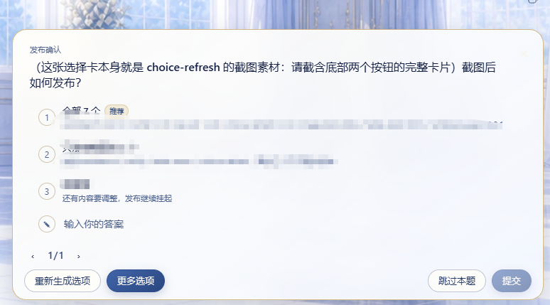
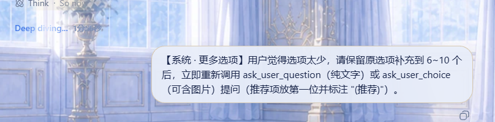

[中文](./README.md) | **English**

# dsh-plugin-choice-refresh


**The only choice-enhancement plugin in the dsh plugin market**: it adds two buttons to the choice cards of `ask_user_question` / `ask_user_choice` —
not happy with any of the options? One click has the model come back with a completely different batch. Too few options? One click has the model add more.

| Button | Scenario | Effect |
| --- | --- | --- |
| 🔄 **Regenerate options** (「重新生成选项」) | None of the offered options works for you | One click has the model re-ask with a completely different batch of options (new angle / style / dimension, 5–8 options) |
| ➕ **More options** (「更多选项」) | Too few options to choose from | One click has the model re-ask while keeping the original options and adding new ones (6–10 options in total) |

Purely client-side interaction, **registers no new tools and modifies no core packages**; works on both native text option cards and the
[dsh-plugin-image-tools](https://github.com/Pasumao/dsh-plugin-image-tools) image option cards (image cards are rendered directly by this plugin, reusing its image routes).

## Screenshot



Two extra buttons appear automatically at the bottom of the card:



After clicking "➕ More options": the model keeps the original options, adds new ones up to 6–10 total, and re-asks.

> Real Web GUI screenshots.

## Features

- 🔄 **Regenerate options**: when none of the options offered by `ask_user_question` / `ask_user_choice` works for you, one click cancels the current question and has the model re-ask with a completely different batch of options (new angle / style / dimension, 5–8 options);
- ➕ **More options**: when the options are too few to choose from, one click has the model keep the original options and add new ones (6–10 in total);
- Purely client-side interaction, **registers no new tools and modifies no core packages**;
- Works on native text option cards and `dsh-plugin-image-tools` image option cards alike;
- Compatible with the `plan-review` plan review card, without affecting the native flow.

## Configuration

No configuration needed — install and it works:

- Reads no environment variables, needs no API key / token, writes no config files;
- Button labels follow `ctx.locale` (zh / en bilingual), with no extra setup;
- Behavior is driven by the `【系统 · 选项刷新】` (system · option refresh) / `【系统 · 更多选项】` (system · more options) messages injected by the buttons; the model re-asks according to those instructions.

## Installation

```powershell
# npm (recommended)
dsh plugin --profile web add dsh-plugin-choice-refresh
# or GitHub
dsh plugin --profile web add github:Pasumao/dsh-plugin-choice-refresh
```

Install from source (local development / debugging):

```bash
git clone https://github.com/Pasumao/dsh-plugin-choice-refresh.git
cd dsh-plugin-choice-refresh
npm install        # or pnpm install
# Mount into the profile via link:, see 设计说明.md (design notes) for details
```

Once installed, refresh the browser and it takes effect (hot-reloads automatically when the profile already has dsh-client-hmr — no restart needed).
For local development, you can mount the plugin via `link:` instead — see `设计说明.md` (design notes) for details.

## Usage

When the model asks a question as usual via `ask_user_question` / `ask_user_choice` (e.g. following the novel-* skills), two extra buttons — **Regenerate options** and **More options** — appear at the bottom of the choice card:

- Click **Regenerate options**: the current question is cancelled, and a `【系统 · 选项刷新】` user message is injected for the model, which immediately re-asks with a fresh set of options;
- Click **More options**: same as above — a `【系统 · 更多选项】` message is injected, and the model keeps the original options and adds more.

> The injected message stays short (one or two lines) and remains in the session as a user message so the model can understand the instruction;
> the UI displays it verbatim.

> Note: the refresh / top-up is done by the model, which re-invokes the question tool after reading the instruction — this is a "soft" enhancement, and the model may occasionally adjust the question itself. If you are still not satisfied with the result, click the button again or simply type what you want.

## Self-check

```powershell
# In the plugin directory (local dev clone / link mount)
npm run smoke   # selfcheck + smoke-client
```

## Compatibility

- Tested on DSH `0.1.1-rc.2`; requires the DSH web GUI (an entry in the `conversation.composer` chain, priority -300).
- Directly compatible with the image cards of a co-installed `dsh-plugin-image-tools`; without it, plain text options work as usual.
- `plan-review` intents (plan review cards) are passed through to the native `PlanReviewPanel`, unaffected.
- Depends on the client services `slots` / `locale` / `sessions` / `remote`.

## Related plugins

This plugin is part of **Pasumao's dsh plugin ecosystem**; the other published plugins in the series pair well with it:

| Plugin (npm) | GitHub | Description |
|---|---|---|
| [dsh-notify](https://www.npmjs.com/package/dsh-notify) | [GitHub repo](https://github.com/Pasumao/dsh-plugin-notify) | Native Windows notifications + system tray |
| [dsh-plugin-dev-kb](https://www.npmjs.com/package/dsh-plugin-dev-kb) | [GitHub repo](https://github.com/Pasumao/dsh-plugin-dev-kb) | Plugin development knowledge base (full mirror of the official docs + skill) |
| [dsh-plugin-image-tools](https://www.npmjs.com/package/dsh-plugin-image-tools) | [GitHub repo](https://github.com/Pasumao/dsh-plugin-image-tools) | Image choice cards + inline images in replies + image handoff for text-only models |
| [dsh-plugin-table-zoom](https://www.npmjs.com/package/dsh-plugin-table-zoom) | [GitHub repo](https://github.com/Pasumao/dsh-plugin-table-zoom) | Floating-window viewer for long chat tables + one-click Markdown copy |
| [dsh-plugin-windows-guard](https://www.npmjs.com/package/dsh-plugin-windows-guard) | [GitHub repo](https://github.com/Pasumao/dsh-plugin-windows-guard) | Windows environment guard: rule skills + mojibake detection / dangerous-write blocking / encoding diagnostics & repair |
| [dsh-plugin-workbench](https://www.npmjs.com/package/dsh-plugin-workbench) | [GitHub repo](https://github.com/Pasumao/dsh-plugin-workbench) | VS Code-style file explorer + editable preview |

> For the rest of the series, see [Pasumao · dsh plugins](https://github.com/Pasumao); if you find them useful, a ⭐ on GitHub is always appreciated.

## AI generation disclosure

Code and documentation are AI-assisted (DeepSeek Harness), all human-reviewed and verified on a live install
(`npm run smoke`: selfcheck + fake-client smoke test).

## License

[MIT](./LICENSE)
